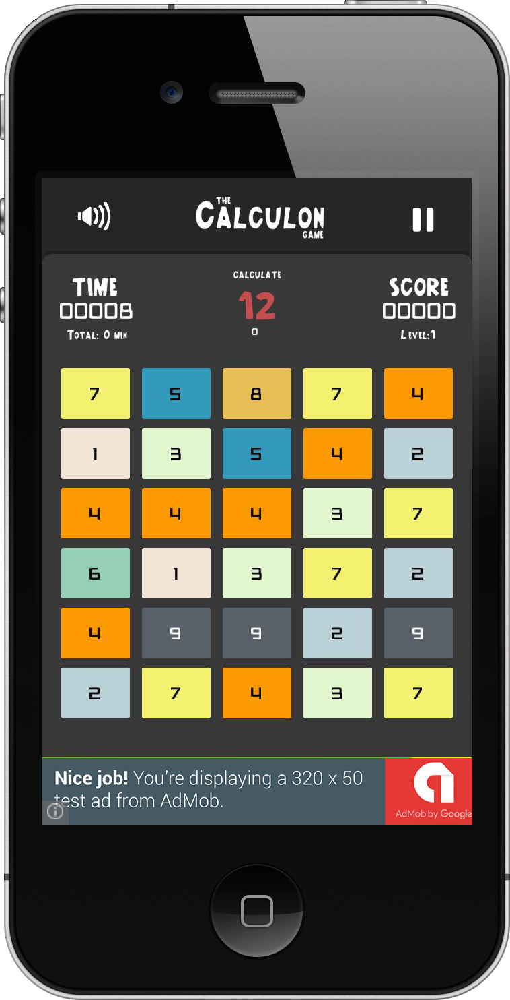

# Gomob
Google Admob Module (IOS) for Godot Engine 2.1-stable

1- GoogleMobileAds.framework copy to <godot-2.1-stable-home>/modules/gomob/ios/lib/

2- Resolve 2.1-stable source code like this issue => https://github.com/godotengine/godot/issues/6849

3- Compile for IOS 

4- How to use on godot:

	if(Globals.has_singleton("Gomob")):
		print("Gomob")
		var gomob = Globals.get_singleton("Gomob")
		gomob.init("your admob Id")
		gomob.set_test(false)
		gomob.show()

  

